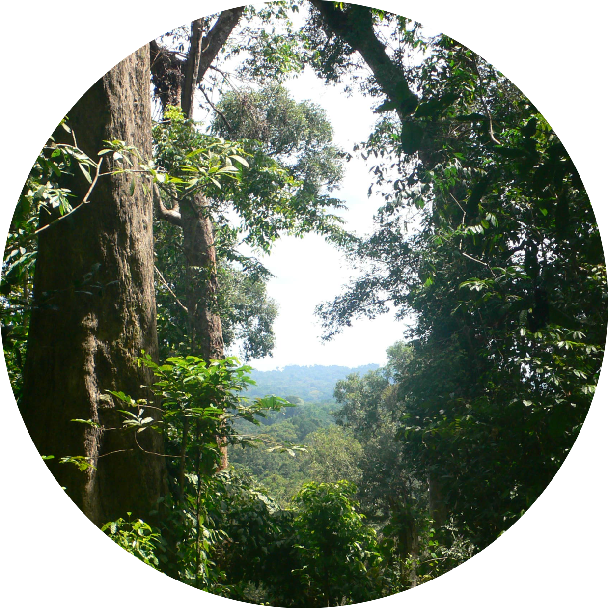

I use a variety of approaches and study groups to understand the evolutionary origins of diversity. My research typically revolves around phylogenetics, population genetics and genomics but also delves into plant health, modelling species distributions and examining patterns of growth and development.

#### __DiveRS__

Angiosperms (flowering plants) present an exceptional diversity of breeding systems, with variation both in gender distribution within and among individuals (from hermaphroditism to separate sexes) and in mating patterns (from strict outcrossing to predominant selfing). Breeding systems have been shown to affect species diversification and to be associated with other life-history and ecological traits. Consequently, breeding systems could be an important determinant of the observed species diversity in flowering plants. The __DiveRS__ project aims at exploring the hypothesis that the combination of traits associated with breeding systems could be an important key to understanding evolutionary success and plant species diversity. 

{width=60%}

#### Evolutionary dynamics of central African rain forests

Tropical rain forests (TRFs) are hyper-diverse ecosystems and ongoing climate change will have an extraordinary impact on their biodiversity. Studying how past climate change, for example the Pleistocene climatic cycles, impacted genetic diversity provides insights into how species reacted to such change. Central Africa contains the second largest expanse of rain forest worldwide and is therefore an ideal system to study how climate change affects diversity. It is thought that most species responded similarly to past climate change, principally through shared glacial refugia. However, we have no temporal scale for these responses, which means we are missing a key piece of the puzzle. To address this shortcoming we used cutting-edge methods to generate a large and comprehensive genomic dataset of over 750 individuals, unparalleled in the study of African TRFs. We use this to estimate the evolutionary and demographic history of seven co-distributed TRF plant species. Did Central African rain forest plants have a shared response to past climate change? 

{width=60%}

#### Development of primary genomic resources for securing sustainable hazelnut production in Turkey

I am using genomic approaches to provide a platform from which we can understand the basis of cold tolerance, drought tolerance and disease resistance in the European hazelnut, Corylus avellana

##

##

{width=60%}

#### Demography and Phylogeny of Madagascan Flora

I'm interested in understanding how population size has changed over time in a variety of Madagascan plant species and using high-throughput sequencing to reconstruct the evolutionary history of species native to the island.

##

##

{width=60%}

#### Adaptation and Speciation Genetics in Silene

The sea campion, Silene uniflora is a small flowering plant that is found on coastlines throughout the UK. According to folklore, sea campion should never be picked for fear of tempting death.

##

##

{width=60%}

#### Evolution of South American Annual Killifish

The genus Austrolebias (order: Cyprinodontiformes) consists of over 40 species of annual killifish found in seasonal ponds distributed across the grasslands, wetlands and savannah of eastern South America. The small bodies of water Austrolebias inhabit dry out completely during the warm summer months meaning that individuals must grow to maturity, mate and lay eggs during the wet season. Once laid, these desiccation-resistant eggs survive an extended period of drought until hatching is triggered by the first autumn rains.

My research aims to uncover why, when and how phenotypic differences among Austrolebias differences evolved in this temporary pond system. I also investigate the structure of the Austrolebias genome using high-throughput sequencing approaches to understand the number, size and location of loci influencing particular traits.

##

##

{width=60%}

#### Diversification and Molecular Evolution in Cyprinodontiformes

The Cyprinodontiformes are an order of approximately 1,200 ray-finned fish species found primarily in Africa and the Americas but also in Asia and Europe. Many of these species are popular in the aquarium trade including guppies, mollies and killifish. Living in a wide range of habitats, they have also evolved different and peculiar reproductive life history strategies such as annualism or viviparity.

My research aims to understand the factors that shape diversity in this group as well as to characterise adaptive evolution and its functional significance across representatives of the order.

##

##

{width=60%}

