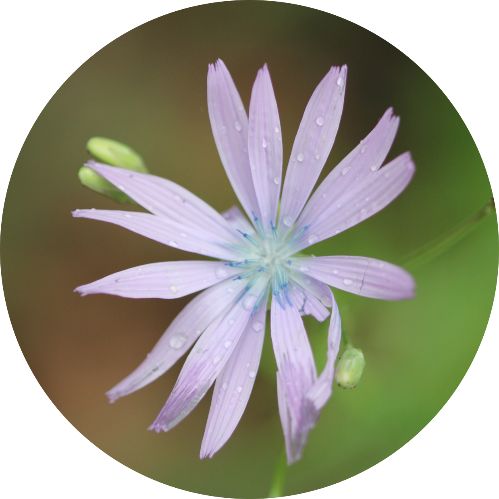

I use a variety of approaches and study groups to understand the evolutionary origins of diversity. My research typically revolves around phylogenetics, population genetics and genomics but also delves into plant health, modelling species distributions and examining patterns of growth and development.

<table id="myTable" style="padding-top:16px padding-bottom:16px">
<tr>
<td>
  
#### From reproductive strategies to species diversity: how evolution of breeding systems and associated traits shape plant biodiversity

_with [Sylvain Glemin](https://scholar.google.fr/citations?user=Ol-P2LQAAAAJ&hl=en), [Jos Kafer](https://lbbe.univ-lyon1.fr/-Kafer-Jos-.html?lang=fr) and [DiveRS](https://www.fondationbiodiversite.fr/en/the-frb-in-action/programs-and-projects/le-cesab/divers/)_

Angiosperms (flowering plants) present an exceptional diversity of breeding systems, with variation both in gender distribution within and among individuals (from hermaphroditism to separate sexes) and in mating patterns (from strict outcrossing to predominant selfing). Breeding systems have been shown to affect species diversification and to be associated with other life-history and ecological traits. Consequently, breeding systems could be an important determinant of the observed species diversity in flowering plants. The __DiveRS__ project aims at exploring the hypothesis that the combination of traits associated with breeding systems could be an important key to understanding evolutionary success and plant species diversity. 

</td>
  
  <td align="right">
  
  {width=60%}
  
  </td>
</tr>

<tr>
  <td>

#### Evolutionary dynamics of central African rain forests

_with [Thomas Couvreur](http://www.couvreurlab.org/)_

Tropical rain forests (TRFs) are hyper-diverse ecosystems and ongoing climate change will have an extraordinary impact on their biodiversity. Studying how past climate change, for example the Pleistocene climatic cycles, impacted genetic diversity provides insights into how species reacted to such change. Central Africa contains the second largest expanse of rain forest worldwide and is therefore an ideal system to study how climate change affects diversity. It is thought that most species responded similarly to past climate change, principally through shared glacial refugia. However, we have no temporal scale for these responses, which means we are missing a key piece of the puzzle. To address this shortcoming we used cutting-edge methods to generate a large and comprehensive genomic dataset of over 750 individuals, unparalleled for African TRFs. We use this to estimate the evolutionary and demographic history of seven co-distributed TRF plant species.

##

##

  </td>
  <td align="right">
  
  {width=60%}
  
  </td>
  
</tr>

<tr>
  <td>

#### Development of primary genomic resources for securing sustainable hazelnut production in Turkey

_with [Richard Buggs](http://richardbuggs.com/) and [Stuart Lucas](http://myweb.sabanciuniv.edu/slucas/)_

Hazelnut ( _Corylus avellana_ L. ) is consumed worldwide and is of critical economic importance to the rural communities of Turkey's northern coast. A new disease outbreak has drastically decreased yields across Turkey and climate change is emerging as a new threat to cultivation. Our study is the first to provide a genomic perspective on diversity in this vulnerable crop, which will prove valuable for future breeding efforts.  We also provide a new p0hylogenetic hypothesis, shoiwng how the cosmopolitan genus _Corylus_ diversified worldwide. Such research into perennial crops like hazelnut can help to improve farmer livelihoods and ensure the sustainability of crop production in a changing world.

  </td>
  <td align="right">
  
  {width=60%}
  
  </td>
  
</tr>

<tr>
  <td>

#### Demography and Phylogeny of Madagascan Flora

_with [Alex Papadopulos](http://labadopulos.co.uk/)_

Current IUCN conservation assessment methods are reliant on observed declines in species population and range sizes over the last one hundred years, but for the majority of species this information is not available. We used a population genetic appraoch to reveal historical demographic decline in the rare endemic flora of Madagascar. These results show that it is possible to predict extinction risk from demographic patterns inferred from genetic data and that destructive human influence is likely to have resulted in the very high frequency of narrow endemics present on the island. Our approach will act as an important tool for rapidly assessing the threatened status of poorly known species in need of further study and conservation, particularly for tropical flora and fauna.

  </td>
  <td align="right">
  
  {width=60%}
  
  </td>
  
</tr>

<tr>
  <td>

#### Adaptation and Speciation Genetics in _Silene_

_with [Alex Papadopulos](http://labadopulos.co.uk/)_

The sea campion, _Silene uniflora_ is a small flowering plant that is found on coastlines throughout the UK. According to folklore, sea campion should never be picked for fear of tempting death. In several locations throughout the UK, this species has colonised and adapted to the highly toxic soils produced by mining in  the last 200 years. We are using a combination of population genomic, gene expression and ecological experiments to address questions about the repeatability of evolution as a result of human activities.

##

##

  </td>
  <td align="right">
  
  {width=60%}
  
  </td>
  
</tr>

<tr>
  <td>

#### Diversification in Cyprinodontiformes

_with [Tom Van Dooren](http://tomvandooren.eu/), [Alex Papadopulos](http://labadopulos.co.uk/) and [Javi Igea](https://www.javierigea.com/)_

The genus _Austrolebias_ (order: Cyprinodontiformes) consists of over 40 species of annual killifish found in seasonal ponds distributed across the grasslands, wetlands and savannah of eastern South America. My research aims to uncover why, when and how phenotypic differences among _Austrolebias_ differences evolved in its ephemeral pond habitat. I also investigate the structure of the _Austrolebias_ genome using high-throughput sequencing approaches to construct a genetic map from hybrid individuals. I also look at macroevolutionary processes in Cyprinodontiformes, an order of approximately 1,200 ray-finned fish species found primarily in Africa and the Americas. Many of these species are popular in the aquarium trade including guppies, mollies and killifish. Living in a wide range of habitats, they have also evolved different and peculiar reproductive life history strategies such as annualism or viviparity. My research aims to understand the factors that shape diversity in this order.

##

##
  </td>
  <td align="right">
  
  {width=60%}
  
  </td>
  
</tr>
</table>